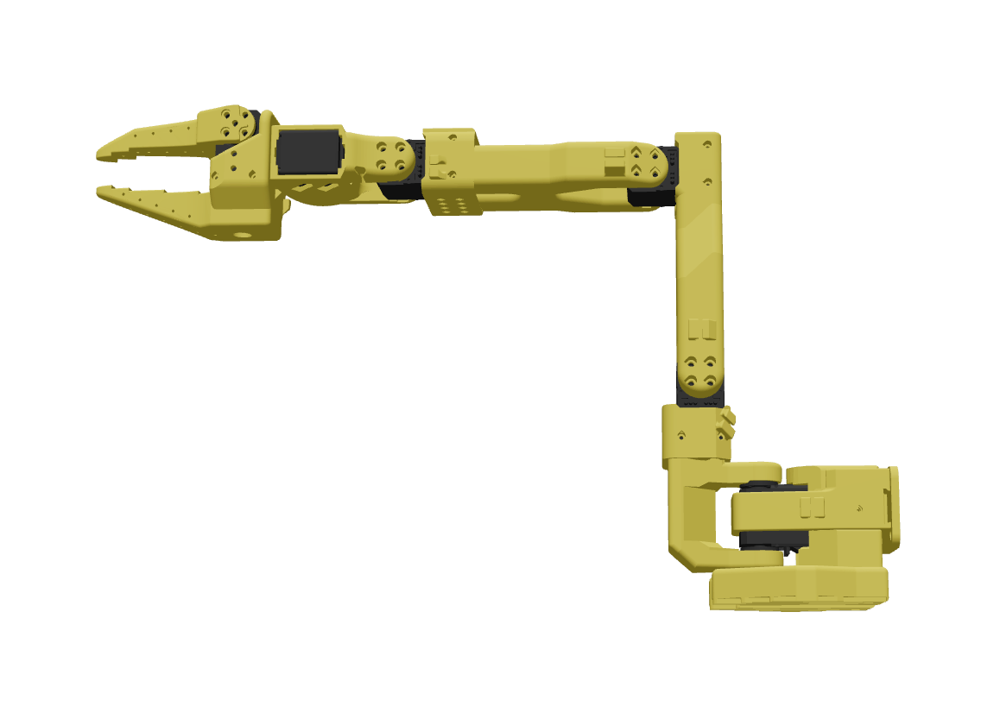

---
# Cyberwave Edge SO-101 node configuration

cyberwave-edge-node:
  name: so101
  description: "Cyberwave Edge node for SO-101"
  commands:
    - find_port
    - local_teleoperate:
        parameters:
          - type: string
            name: leader-port
          - type: string
            name: follower-port
          - type: string
            name: camera-type
            choices:
              - cv2
              - realsense
    - remote_teleoperate:
      parameters:
        - type: string
          name: leader-port
    - calibrate:
        parameters:
          - type: string
            name: port
            description: The port of the SO101 device
            required: true
          - type: string
            name: type
            description: The type of the SO101 device
            required: true
            choices:
              - leader
              - follower
---

<p align="center">
  <a href="https://cyberwave.com">
    
  </a>
</p>

# Cyberwave SO101 Driver

This module is part of **Cyberwave: Making the physical world programmable**.

[](https://opensource.org/licenses/Apache-2.0)
[](https://docs.cyberwave.com)
[](https://discord.gg/dfGhNrawyF)
[](https://pypi.org/project/cyberwave-so101/)
[](https://pypi.org/project/cyberwave-so101/)
[](https://github.com/cyberwave-os/cyberwave-edge-python-so101/actions/workflows/push-to-docker-hub.yml)

A standalone Python library for operating SO101 leader and follower robots using `scservo_sdk` (Feetech) directly.

## Features

- **Local teleoperation** — Control the follower with a physical leader arm (both connected locally)
- **Remote operation** — Control the follower from anywhere via the Cyberwave web app
- **Calibration** — Interactive calibration with range-of-motion recording
- **Camera streaming** — CV2 (USB/webcam/IP) and Intel RealSense with WebRTC
- **Edge Core integration** — Auto-discovers leader/follower ports (5V=leader, 12V=follower), cameras from twin JSONs, and starts the right mode from the controller policy
- **CLI tools** — `so101-find-port`, `so101-calibrate`, `so101-teleoperate`, `so101-remoteoperate`, `so101-motor-dump`

## Installation

### Prerequisites

- Python 3.8 or higher
- Serial port access to SO101 devices (e.g. `/dev/ttyACM0`, `/dev/tty.usbmodem*` on macOS)

### Install from Source

```bash
git clone https://github.com/cyberwave/cyberwave.git
cd cyberwave/cyberwave-edge-nodes/cyberwave-edge-so101
pip install -e .
```

### Dependencies

- `pyserial>=3.5` - Serial communication
- `feetech-servo-sdk` - Feetech motor SDK
- `cyberwave[camera]>=0.3.24` - Cyberwave platform integration and camera streaming (CV2 cameras)
- `python-dotenv>=1.0.0` - Environment variable loading

For Intel RealSense support, install `cyberwave[realsense]` separately.

The package pins a `cyberwave[camera]` version in `pyproject.toml`. Camera defaults (resolution, FPS, CV2 FOURCC negotiation) come from that installed SDK, not from this repo’s `cyberwave-sdks/` tree unless you install the SDK in editable mode.

**Verify which SDK is active** (path + version):

```bash
python -c "import importlib.metadata as m; import cyberwave; print('version', m.version('cyberwave')); print('path', cyberwave.__file__)"
```

To use a local checkout: `pip install -e ../../cyberwave-sdks/cyberwave-python` (adjust path), then re-run the one-liner above.

### Environment Variables

```bash
export CYBERWAVE_API_KEY=your_token_here
```

Required for teleoperation and remote operation. Add to `~/.bashrc` or `~/.zshrc` to make it persistent.

#### Status display

Teleoperation and remote operation show a live full-screen status panel while
running. It is drawn only when stdout is a terminal — in a container the driver
logs a single-line summary once a minute instead, so the panel's 1 Hz repaints
don't accumulate in the container log.

| Variable | Default | Purpose |
| --- | --- | --- |
| `CYBERWAVE_STATUS_TUI` | auto | Force the panel on (`1`) or off (`0`). Unset means "draw it only on a terminal". Set it to `1` when running with `docker run -it`. |
| `CYBERWAVE_STATUS_SUMMARY_SECONDS` | `60` | Seconds between one-line status summaries when the panel is off. |

Motor temperature alerts, overheat detection and motor telemetry publishing run
at 1 Hz either way — only the drawing is affected.

## Quick Start

### 1. Set Up Environment

```bash
export CYBERWAVE_API_KEY=your_token_here
```

### 2. Find Device Port

```bash
so101-find-port
```

This will interactively help you identify the serial port of your SO101 device.

### 3. Read Device Data

```bash
so101-read-device --port /dev/ttyACM0
```

### 4. Calibrate Device

```bash
so101-calibrate --type leader --port /dev/ttyACM0
so101-calibrate --type follower --port /dev/ttyACM1
```

### 5. Teleoperate with Cyberwave

```bash
so101-teleoperate --leader-port /dev/ttyACM0 --follower-port /dev/ttyACM1
```

A twin is created automatically if `--twin-uuid` is not provided. Camera streaming uses default settings (USB camera 0). See [Advanced Settings](#advanced-settings) for camera options.

## Command-Line Tools

### `so101-setup`

Generate `setup.json` with a flat `cameras` list (per-camera twin UUID, type, and device). In code, each row is a `so101.camera.CameraConfig` (`from_setup_camera_dict` / `to_setup_camera_dict`). The edge node reads this file; with edge-core, `CYBERWAVE_CHILD_TWIN_UUIDS` plus auto-discovery usually populate it on startup, so manual `so101-setup` is rarely needed.

### `so101-find-port`

Interactively find the serial port of your SO101 device.

```bash
so101-find-port
```

### `so101-read-device`

Read and display data from SO101 motors.

```bash
so101-read-device --port /dev/ttyACM0
```

Add `--continuous` for live updates every second.

### `so101-motor-dump`

Collect all motor register data from leader and/or follower and save to JSON. Used automatically on startup by the edge node to populate `twin.metadata["robot_dump"]`; also available for manual diagnostics.

```bash
so101-motor-dump --port /dev/ttyACM0 -o motor_dump.json
```

Options: `--port` / `-p` (required), `--output` / `-o` (default: `motor_dump_YYYYMMDD_HHMMSS.json`), `--motor` / `-m` (single motor ID 1–6), `--skip-preflight`, `--pretty`.

### `so101-calibrate`

Calibrate SO101 leader or follower devices.

```bash
so101-calibrate --type leader --port /dev/ttyACM0
so101-calibrate --type follower --port /dev/ttyACM1
```

Use `--find-port` to discover the port interactively. The `--id` defaults to `leader1` or `follower1`. See [Advanced Settings](#advanced-settings) for custom calibration dir, voltage rating, etc.

**Calibration Process:**

1. Move the device to the zero pose (starting position) as shown in the image below:

   

   This is the recommended starting position for calibration, with all joints in a well-defined configuration.

2. Press ENTER to set homing offsets
3. Move all joints through their full ranges of motion
4. Press ENTER to stop recording
5. Calibration is saved to `~/.cyberwave/so101_lib/calibrations/{id}.json`

### Teleoperate vs Remote Operate

| | **Teleoperate** (local controller) | **Remote Operate** (Cyberwave controller) |
|---|---|---|
| **Controller** | Physical leader arm connected locally (same machine as follower) | Cyberwave web app or API (user controls from browser/remote) |
| **Hardware** | Leader + follower (both on serial ports) | Follower only |
| **Data flow** | Leader → local process → follower → Cyberwave | Cyberwave (MQTT) → local process → follower |
| **Use case** | Hands-on teleoperation: move the leader arm, follower mirrors in real time | Remote control: operate the robot from anywhere via the Cyberwave application |

**Teleoperate** reads joint positions from the leader arm, sends them to the follower, and publishes the follower state to Cyberwave. The operator is physically at the edge device.

**Remote Operate** subscribes to joint states from Cyberwave (sent when a user controls the twin in the app), then writes those targets to the follower. The operator can be anywhere.

### `so101-teleoperate`

Run teleoperation with a **local leader arm**: read from leader, mirror to follower, stream to Cyberwave. Requires `CYBERWAVE_API_KEY`.

```bash
so101-teleoperate --leader-port /dev/ttyACM0 --follower-port /dev/ttyACM1
```

Uses default USB camera (device 0) and 30 FPS. See [Advanced Settings](#advanced-settings) for camera options, RealSense, IP streams, and config files.

### `so101-remoteoperate`

Run remote operation: receive joint states from the **Cyberwave application** via MQTT and write to the follower. Requires `CYBERWAVE_API_KEY`.

```bash
so101-remoteoperate --follower-port /dev/ttyACM1
```

See [Advanced Settings](#advanced-settings) for camera options.

## Advanced Settings

### `so101-teleoperate` and `so101-remoteoperate` — Camera Options

| Option | Description | Default |
|--------|-------------|---------|
| `--twin-uuid` | Cyberwave twin UUID | Auto-created if omitted |
| `--fps` | Teleoperation loop FPS | 30 |
| `--camera-fps` | Camera streaming FPS | 30 |
| `--camera-type` | `cv2` (USB/webcam/IP) or `realsense` | cv2 |
| `--camera-id` | Camera device ID or RTSP URL | 0 |
| `--camera-resolution` | QVGA, VGA, SVGA, HD, FULL_HD, or WIDTHxHEIGHT | VGA |
| `--camera-config` | Path to JSON config file | — |
| `--enable-depth` | RealSense depth streaming | false |
| `--depth-fps`, `--depth-resolution`, `--depth-publish-interval` | RealSense depth options | — |
| `--camera-only` | Stream camera only, no teleoperation | — |
| `--max-relative-target` | Follower safety limit (remoteoperate) | — |
| `--follower-id` | Calibration file ID (remoteoperate) | follower1 |

**Examples:**

```bash
# RealSense with depth
so101-teleoperate --leader-port /dev/ttyACM0 --follower-port /dev/ttyACM1 \
    --camera-type realsense --enable-depth --camera-resolution HD

# IP camera / RTSP
so101-teleoperate --leader-port /dev/ttyACM0 --camera-id "rtsp://192.168.1.100:554/stream"

# Use config file
so101-teleoperate --leader-port /dev/ttyACM0 --camera-config camera_config.json
```

### Camera Configuration File

Generate a config: `so101-teleoperate --generate-camera-config` (add `--camera-type realsense --auto-detect` for RealSense). List RealSense devices: `so101-teleoperate --list-realsense`.

**CV2 USB:**
```json
{"camera_type": "cv2", "camera_id": 0, "fps": 30, "resolution": [640, 480]}
```

**RealSense with depth:**
```json
{"camera_type": "realsense", "fps": 30, "resolution": [1280, 720], "enable_depth": true, "depth_fps": 15}
```

**IP/RTSP:**
```json
{"camera_type": "cv2", "camera_id": "rtsp://192.168.1.100:554/stream", "fps": 15, "resolution": [640, 480]}
```

### `so101-calibrate` — Advanced Options

- `--id` — Device ID for calibration file (default: leader1 / follower1)
- `--calibration-dir` — Custom calibration directory
- `--voltage-rating` — 5 or 12 (auto-detected if omitted)

### `so101-read-device` — Advanced Options

- `--motor-ids` — Read specific motors (e.g. `--motor-ids 1 2 3`)
- `--show-raw` — Show raw register values

### Diagnostic Scripts

- `scripts/cw_motor_info.py` — Dump all motor registers to stdout (human-readable)
- `scripts/cw_motor_dump.py` — Collect every register from every motor and save to JSON

```bash
python scripts/cw_motor_dump.py --port /dev/ttyACM0 --output motor_dump.json
```

## Python API

### Basic Usage

```python
from so101.leader import SO101Leader
from utils.config import LeaderConfig

# Create leader configuration
config = LeaderConfig(port="/dev/ttyACM0", id="leader1")

# Initialize and connect
leader = SO101Leader(config=config)
leader.connect()

# Get current joint positions (normalized)
positions = leader.get_observation()
# Returns: {"shoulder_pan.pos": 0.0, "shoulder_lift.pos": 0.0, ...}

# Disconnect
leader.disconnect()
```

### Calibration

```python
from so101.leader import SO101Leader
from utils.config import LeaderConfig

config = LeaderConfig(port="/dev/ttyACM0", id="leader1")
leader = SO101Leader(config=config)
leader.connect()

# Run calibration (interactive)
leader.calibrate()

# Calibration is automatically saved to ~/.cyberwave/so101_lib/calibrations/leader1.json
```

### Teleoperation

```python
from so101.leader import SO101Leader
from so101.follower import SO101Follower
from utils.config import LeaderConfig, FollowerConfig
from scripts.cw_teleoperate import teleoperate
from cyberwave import Cyberwave
from cyberwave.sensor import Resolution

# Initialize Cyberwave client (reads token from CYBERWAVE_API_KEY env var)
cyberwave_client = Cyberwave()
robot = cyberwave_client.twin(asset_key="the-robot-studio/so101", twin_id="YOUR_TWIN_UUID", name="robot")
camera = cyberwave_client.twin(asset_key="cyberwave/standard-cam", twin_id="YOUR_TWIN_UUID", name="camera")

# Initialize leader
leader_config = LeaderConfig(port="/dev/ttyACM0", id="leader1")
leader = SO101Leader(config=leader_config)
leader.connect()

# Optionally initialize follower
follower_config = FollowerConfig(port="/dev/ttyACM1", id="follower1")
follower = SO101Follower(config=follower_config)
follower.connect()

# Build cameras list (each dict: twin, camera_id, camera_type, camera_resolution, fps)
cameras = [{
    "twin": camera,
    "camera_id": 0,
    "camera_type": "cv2",
    "camera_resolution": Resolution.HD,
    "fps": 30,
}]

try:
    teleoperate(
        leader=leader,
        cyberwave_client=cyberwave_client,
        follower=follower,
        robot=robot,
        cameras=cameras,
    )
finally:
    leader.disconnect()
    if follower:
        follower.disconnect()
    cyberwave_client.disconnect()
```

### Remote Operation

```python
from so101.follower import SO101Follower
from utils.config import FollowerConfig
from scripts.cw_remoteoperate import remoteoperate
from cyberwave import Cyberwave
from cyberwave.sensor import Resolution

# Initialize Cyberwave client
cyberwave_client = Cyberwave()
robot = cyberwave_client.twin(asset_key="the-robot-studio/so101", twin_id="YOUR_TWIN_UUID", name="robot")
camera = cyberwave_client.twin(asset_key="cyberwave/standard-cam", twin_id="YOUR_TWIN_UUID", name="camera")

# Initialize follower
follower_config = FollowerConfig(port="/dev/ttyACM1", id="follower1")
follower = SO101Follower(config=follower_config)
follower.connect()

# Build cameras list
cameras = [{
    "twin": camera,
    "camera_id": 0,
    "camera_type": "cv2",
    "camera_resolution": Resolution.VGA,
    "fps": 30,
}]

try:
    remoteoperate(
        client=cyberwave_client,
        follower=follower,
        robot=robot,
        cameras=cameras,
    )
finally:
    follower.disconnect()
    cyberwave_client.disconnect()
```

## Calibration Format

Calibration files are saved as JSON in `~/.cyberwave/so101_lib/calibrations/{id}.json`:

```json
{
  "shoulder_pan": {
    "id": 1,
    "drive_mode": 0,
    "homing_offset": 116,
    "range_min": 741,
    "range_max": 3441
  },
  "shoulder_lift": {
    "id": 2,
    "drive_mode": 0,
    "homing_offset": 778,
    "range_min": 907,
    "range_max": 3284
  },
  ...
}
```

**Fields:**

- `id`: Motor ID (1-6)
- `drive_mode`: Drive mode (0 = normal, 1 = reversed)
- `homing_offset`: Homing offset value (raw encoder units)
- `range_min`: Minimum position recorded during calibration (raw encoder units)
- `range_max`: Maximum position recorded during calibration (raw encoder units)

## Configuration

### LeaderConfig

```python
from utils.config import LeaderConfig

config = LeaderConfig(
    port="/dev/ttyACM0",  # Serial port
    use_degrees=True,              # Use degrees (deprecated, use norm_mode instead)
    id="leader1",                  # Device identifier
    calibration_dir=None,          # Custom calibration directory (default: ~/.cyberwave/so101_lib/calibrations)
    voltage_rating=None,           # 5 or 12 (auto-detected if None)
)
```

### FollowerConfig

```python
from utils.config import FollowerConfig

config = FollowerConfig(
    port="/dev/ttyACM1",
    use_degrees=True,
    id="follower1",
    calibration_dir=None,
    voltage_rating=None,
    max_relative_target=0.1,       # Maximum relative target change (safety limit)
    cameras=None,                   # Optional camera configuration
)
```

## Troubleshooting

### Port Not Found

If you can't find your device port:

```bash
so101-find-port
```

This will list available ports and help you identify the correct one.

### Calibration Required

Teleoperation requires a valid calibration file. If you see:

```
RuntimeError: No calibration file found at ...
```

Run calibration first:

```bash
so101-calibrate --type leader --port /dev/ttyACM0
```

(Note: `--id` is optional and defaults to `leader1` for `--type leader`)

### RealSense Stream Connects but No Picture Appears

The driver publishes each camera stream under a sensor key taken from the twin's
declared sensors, and viewers subscribe using that same key. A RealSense twin
declares `color_camera`; if the edge publishes under any other key, WebRTC still
connects and the frame counter still advances, but nothing ever renders.

If your RealSense shows no picture while a plain USB camera on the same robot works,
check that the stream key matches the twin's sensor. The driver logs it on the
WebRTC answer:

```
Processing answer targeted at edge (sensor=color_camera, answer_sensor=color_camera)
```

A `sensor=` value that isn't one of the twin's declared sensors is the problem.

### RealSense and USB Camera Fighting Over One Device

A RealSense exposes several `/dev/video*` nodes for one physical camera (depth, IR,
color, plus a metadata node each). If a saved camera mapping points at one of those
nodes for a different twin, two streams end up fighting over the same device.

The driver now detects this and logs which twin was remapped:

```
Child <uuid> is a RealSense twin but edge config maps non-RealSense node /dev/video4; ...
Child <uuid> is an RGB twin but edge config maps RealSense node /dev/video2; ...
Child <uuid>: edge config maps /dev/video9 but no discovered camera exposes that node; ...
```

Node numbering shifts whenever a camera re-enumerates (re-plug, reboot), so a mapping
that worked before can go stale. Check what the driver picked with:

```bash
v4l2-ctl --list-devices
```

then re-select the camera for the twin in the dashboard to refresh the mapping.

### Environment Variables Not Set

If you see errors about missing Cyberwave token:

```
ValueError: No CYBERWAVE_API_KEY found! Get yours at https://cyberwave.com/profile
```

Set the required environment variable:

```bash
export CYBERWAVE_API_KEY=your_token_here
```

Get your token from [https://cyberwave.com/profile](https://cyberwave.com/profile)

### Voltage Detection

The library can auto-detect voltage rating (5V or 12V) from motor registers. If detection fails, you can specify it manually:

```bash
so101-calibrate --type leader --port /dev/ttyACM0 --voltage-rating 5
```

(Note: `--id` is optional and defaults to `leader1` for `--type leader`)

### Connection Issues

- Ensure the device is powered on
- Check USB cable connection
- Verify port permissions (on Linux, you may need to add your user to the `dialout` group)
- Try a different USB port

### macOS Docker Desktop: serial bridge (arms)

USB/IP **cannot** carry the arms' serial data on macOS. macOS keeps its own
`AppleUSBACM` driver attached to the CDC interface and Darwin has no
`libusb_detach_kernel_driver`, so an import enumerates `/dev/ttyACM*` inside the
container while its bulk endpoints stay inert — reads return nothing and opens
fail with `EIO` or hang.

`cyberwave edge install` therefore publishes each detected SO-101 USB serial
device over TCP, the same shape as the camera MJPEG and audio bridges:

1. One `launchd` service per device (`com.cyberwave.serial-bridge[.N]`) serves
   `/dev/cu.*` on a TCP port starting at 8300 (kept clear of the camera,
   microphone and speaker bridges)
2. The mapping is written to `~/.cyberwave/serial_bridges.json`
3. edge-core reads it and passes `CYBERWAVE_SERIAL_BRIDGE_PORTS` to the driver
4. The entrypoint runs one `socat PTY,link=/dev/ttyACM<N> TCP:...` per port, so
   the driver opens an ordinary serial device and voltage autodiscovery assigns
   leader/follower as usual

The bridge takes precedence over USB/IP: when `CYBERWAVE_SERIAL_BRIDGE_PORTS` is
set for the SO-101 image, its USB/IP block is skipped for both serial and video.
SO-101 camera twins use the host MJPEG mappings in this mode. Other driver images
that do not declare serial-bridge support retain their normal USB/IP path.

> The host side uses pyserial rather than `socat`: the arms run at 1 Mbaud and
> macOS `socat` cannot apply a non-standard baud (`tcsetattr: Invalid argument`),
> whereas pyserial goes through the `IOSSIOSPEED` ioctl. The container side does
> use `socat`, where the PTY's own baud is irrelevant.

**Serial bridge environment variables:**

| Variable | Default | Purpose |
|----------|---------|---------|
| `CYBERWAVE_SERIAL_BRIDGE_PORTS` | _(unset)_ | Comma-separated host TCP ports; set by edge-core from `serial_bridges.json` |
| `CYBERWAVE_SERIAL_BRIDGE_HOST` | `host.docker.internal` | Host serving the bridges |
| `CYBERWAVE_SERIAL_BRIDGE_WAIT_SECS` | `10` | Max seconds to wait for each PTY to appear |
| `CYBERWAVE_SERIAL_DEVICE_GLOB` | `/dev/cu.usbmodem*` | Host-side glob override for adapters under another prefix; setting it explicitly disables the default SO-101 VID:PID filter |
| `CYBERWAVE_USBIP_SERIAL_VIDPID` | `1a86:55d3` | SO-101 adapter VID:PID used by host bridge discovery and USB/IP readiness checks |

### macOS Docker Desktop: USB Device Passthrough (cameras)

Docker Desktop on macOS runs containers inside a Linux VM that cannot directly
access host USB devices. The SO-101 driver uses **USB/IP** only when edge-core
finds zero healthy host serial-bridge listeners as the container launches. This
is a host-level fallback: one remaining healthy bridge keeps bridge mode active,
so USB/IP does not fill in an individual missing arm alongside it.

**Setup** (handled automatically by `cyberwave edge install`):

1. The CLI clones and builds the [jiegec/usbip](https://github.com/jiegec/usbip) Rust-based host server into `~/.cyberwave/usbip/`
2. A shell wrapper script (`~/.cyberwave/usbip_wrapper.sh`) is created to launch the binary — this avoids macOS code-signing restrictions that block unsigned binaries from running under `launchd`
3. A `launchd` agent (`com.cyberwave.usbip`) is installed into the user's GUI domain so the server starts automatically on login
4. Extended attributes (`com.apple.quarantine`, `com.apple.provenance`) are stripped from the binary to prevent Gatekeeper blocks
5. All artifacts are `chown`-ed to the real user when installed via `sudo`
6. Before creating a driver container, the edge core runs the image once with `--usbip-attach-only`, which attaches the arm buses and reports the device paths that resulted
7. The edge core then starts the driver container with `--pid=host` and an explicit `--device` mapping per reported path
8. The container entrypoint uses `nsenter` + `usbip attach` to auto-discover and attach any remaining non-hub USB devices, recreating device nodes locally for anything that appeared after the container was created
9. Serial controllers appear as `/dev/ttyACM*`, cameras as `/dev/video*`, RealSense devices via `libusb`

> **Why the pre-attach in step 6:** Docker fills a privileged container's `/dev` by snapshotting the VM's device list when the container is **created**. A container that attaches its own USB/IP devices therefore never sees them — the nodes appear in the VM only after that snapshot was taken. Attaching first means the nodes already exist and map in normally. This path is selected only when edge-core finds no healthy serial bridge at driver launch.

> **Why the attach enters the VM's network namespace:** `usbip attach` hands its TCP socket to the VM kernel, which keeps it open for the entire device session. `nsenter -t 1 -m` enters only the *mount* namespace, so that socket is created in the **container's** network namespace and the session dies when the container exits — leaving a `/dev/ttyACM*` node that opens with `EIO` or hangs, and imports that vanish on every driver restart. The attach therefore uses `nsenter -t 1 -m -n`, tying the session to the VM instead. Because Docker's embedded DNS is unreachable from that namespace, the host name is resolved to an address first.

> **Note:** Auto-discovery attaches every exported USB device **except hubs**. Attaching a Hub-class device panics the `jiegec/usbip` host server (it doesn't implement hub-class control requests), which then reports zero exportable devices until its `launchd` service is restarted — every Mac exports at least one internal hub, so this is skipped unconditionally. The host operator otherwise controls which devices are exported (the server exports everything connected). If you need selective attachment, set `CYBERWAVE_USBIP_BUSID` to a specific bus ID in the container environment.

**USB/IP environment variables:**

| Variable | Default | Purpose |
|----------|---------|---------|
| `CYBERWAVE_USBIP_BUSID` | _(unset — auto-discover)_ | Attach a single specific bus ID instead of every exported device |
| `CYBERWAVE_USBIP_SERIAL_VIDPID` | `1a86:55d3` | VID:PID of the SO-101 arm's serial bus (WCH); used to count expected arms so the entrypoint waits for all of them, not just the first |
| `CYBERWAVE_USBIP_WAIT_SECS` | `30` | Max seconds to wait for the expected serial device(s) to enumerate |
| `CYBERWAVE_USBIP_DETACH_STALE` | `1` | Detach any USB/IP imports left over from a previous container run before attaching fresh (set to `0` to disable) |
| `CYBERWAVE_USBIP_PREATTACHED` | _(unset)_ | Set to `1` by the edge core when it already attached the buses and mapped them in with `--device`. The entrypoint then skips discovery instead of detaching those imports as stale and re-attaching duplicates |

**Supported USB device types:**

| Device type | Protocol | Container path | Notes |
|-------------|----------|---------------|-------|
| Serial motor controllers | USB CDC | `/dev/ttyACM*` | Low bandwidth, works reliably |
| USB webcams | USB UVC → V4L2 | `/dev/video*` | Higher bandwidth; benchmark with `cw_benchmark_camera.py` |
| Intel RealSense | USB → libusb | Detected by `pyrealsense2` | Depth+color requires USB 3.0 bandwidth |

**Manual verification** inside the container:

```bash
nsenter -t 1 -m -- usbip list -r host.docker.internal
```

**Benchmarking camera performance** (run inside the container):

```bash
python -m scripts.cw_benchmark_camera --device 0 --seconds 10
python -m scripts.cw_benchmark_realsense --seconds 10
```

**MJPEG stream fallback** (when USB/IP video bandwidth is insufficient):

On macOS, `cyberwave edge install` starts one host stream per configured camera
and Edge Core passes the child-twin-to-stream mapping to the SO101 container.
When the serial bridge is active, every SO-101 camera must use one of these
MJPEG mappings; USB/IP cameras are not available in the same SO-101 container.

```bash
# On macOS host — start ffmpeg MJPEG server:
ffmpeg -f avfoundation -framerate 30 -video_size 640x480 -i "0" \
  -c:v mjpeg -q:v 5 -f mjpeg -listen 1 http://0.0.0.0:8091

# Configure edge-core to use the stream URL:
export CYBERWAVE_MACOS_CAMERA_STREAM_URL=http://host.docker.internal:8091
```

The driver's `cv2.VideoCapture` natively supports HTTP MJPEG URLs — no code changes needed.

The per-child mapping is an internal Edge Core contract carried in
`CYBERWAVE_CHILD_CAMERA_STREAM_URLS`; users normally should not set it manually.

**Troubleshooting:**

To tear down and rebuild the entire USB/IP setup from scratch:

```bash
sudo cyberwave edge install --force-reinstall
```

This stops the launchd service, removes all artifacts (binary, wrapper, plist, logs), and re-runs the full setup.

Check if the USB/IP server is running (port 3240):

```bash
lsof -nP -iTCP:3240 -sTCP:LISTEN
```

> A listening process is not proof of health. The server can stay up while its exportable-device list is empty (see the hub note above), and `launchd`'s `KeepAlive` never fires because the process never exits. If `usbip list -r host.docker.internal` returns nothing while the arms are plugged in, restart the service. The wrapper sets `RUST_LOG=info` so `~/.cyberwave/usbip.log` captures why — an empty log on an older wrapper means logging was never enabled, not that the server is quiet; re-run `cyberwave edge install` to regenerate it.

If not running, restart the launchd service:

```bash
launchctl bootout gui/$(id -u)/com.cyberwave.usbip 2>/dev/null
launchctl bootstrap gui/$(id -u) ~/Library/LaunchAgents/com.cyberwave.usbip.plist
```

Or run the server manually in the foreground for debugging:

```bash
RUST_LOG=info ~/.cyberwave/usbip/target/release/examples/host
```

## Edge Core Integration

When deployed with [Cyberwave Edge Core](https://github.com/cyberwave/cyberwave-edge-core), the SO101 node runs as a Docker container and handles configuration **automatically**. No manual port or camera setup is required.

### How Edge Core Runs the SO101 Node

- Edge core mounts the config directory (`/etc/cyberwave` or `CYBERWAVE_EDGE_CONFIG_DIR`) into the container at `/app/.cyberwave`
- Twin JSON files (from the edge install flow) are synced into this directory
- Environment variables: `CYBERWAVE_TWIN_UUID`, `CYBERWAVE_API_KEY`, `CYBERWAVE_TWIN_JSON_FILE`, `CYBERWAVE_EDGE_CONFIG_DIR`
- The entrypoint (`entrypoint.sh`) loads twin metadata from the JSON file into env vars, then runs `main.py`

### Automatic Setup on Startup

On startup, `main.py` runs `_ensure_setup(twin_uuid)`, which bootstraps `setup.json` without user input:

1. **Leader/follower port detection**  
   Scans serial ports (`/dev/ttyACM*`, `/dev/ttyUSB*` on Linux; `/dev/tty.usbmodem*` on macOS), runs voltage detection on each SO101 device, and assigns:
   - **5V** → leader port  
   - **12V** → follower port  
   If one port fails voltage detection but exactly two ports are found, the missing role is inferred from the other.

2. **Motor dump**  
   Runs `so101-motor-dump` for each discovered port (leader and follower). The result is stored in `twin.metadata["robot_dump"]` as a dict keyed by port (e.g. `{"/dev/ttyACM0": {...}, "/dev/ttyACM1": {...}}`). Each entry has `metadata` (timestamp, port, baudrate, motor_names) and `motors` (per-motor register data). Requires `CYBERWAVE_API_KEY`.

3. **Camera discovery**  
   Builds a flat `cameras` list for `setup.json`:
   - If **`CYBERWAVE_CHILD_TWIN_UUIDS`** is set (edge-core), those UUIDs are the camera twins in order; each is resolved from its twin JSON and matched to discovered V4L2/RealSense devices.
   - Otherwise, discovery uses the primary robot twin’s edge camera mapping (`metadata.edge_configs.camera_config.sensors_devices` plus RGB sensors from the universal schema), other **camera-like** twins linked to the workspace (e.g. attached RealSense), and fills remaining slots by assigning unused compatible devices to the robot twin when needed.

4. **Setup merge**  
   Writes `setup.json` to `~/.cyberwave/so101_lib/` (or `CYBERWAVE_EDGE_CONFIG_DIR/so101_lib/` in the container), merging discovered ports and cameras with any existing config (e.g. from a previous `so101-calibrate` run).
   Invalid or incomplete setup files are removed and regenerated automatically. Updates are written atomically so an interrupted container cannot leave partial JSON behind.

### Controller Policy and Operations

The node subscribes to MQTT command messages. When the backend sends `controller-changed` (e.g. after a user switches the twin’s controller policy):

- **`localop`** → starts `so101-teleoperate` (leader + follower, local teleoperation)
- **`freedrive`** → starts read-only joint-state streaming (see [Freedrive](#freedrive-read-only-joint-streaming))
- **Other** → starts `so101-remoteoperate` (follower only, receives joint states from the frontend via MQTT)

Both operations read hardware config from `setup.json` (ports, cameras, `max_relative_target`). No CLI arguments are needed.

### Freedrive (read-only joint streaming)

Assign a **Freedrive** controller policy to release the arm's torque and stream its real joint angles to its twin. The node polls the follower's measured positions and publishes them on `cyberwave/joint/{twin_uuid}/update` at 5 Hz, sending no commands — so you can move the arm by hand and watch the twin follow it.

Freedrive is a normal operation: only one runs at a time, so assigning a teleop or remote controller replaces it, and it goes through the same calibration check as the others.

| Variable | Default | Purpose |
| --- | --- | --- |
| `CYBERWAVE_SO101_FREEDRIVE_HZ` | `5` | Freedrive publish rate (teleop/remoteop publish at ~33 Hz) |

### Calibration-Required Flow (Advanced)

This section documents the full calibration flow used by `main.py`. It is intended for advanced users implementing compatible custom drivers.

#### Entry points

Calibration can start from:

- A control operation request (`teleoperate` / `remoteoperate`) when calibration is missing
- A frontend/manual restart path that sends calibration commands

When missing calibration is detected, the driver stores a pending recovery command (`teleoperate` or `remoteoperate`) and creates a **step-0** alert.

#### Alert/button protocol used by the driver

The flow is driven by alert metadata buttons. The button payload is forwarded by backend as MQTT command:

- MQTT command: `command: "button"`
- Command data: `data = metadata.buttons[i].payload` (forwarded as-is)

The driver uses payloads like:

```json
{
  "flow": "so101_calibration",
  "action": "start",
  "type": "follower",
  "follower_port": "/dev/ttyACM0",
  "follower_id": "follower1",
  "leader_port": "/dev/ttyACM1",
  "leader_id": "leader1",
  "recovery_command": "teleoperate",
  "alert_uuid": "..."
}
```

For backward compatibility, `command: "calibrate"` with `step` is also supported.

#### Guided steps and transitions

1. **Step 0 (`idle`)**  
   Alert: **Calibration Needed**  
   Button: **Start calibration** (`action: "start"`)
2. **Step 1 (`zero_pose_waiting`)**  
   Previous alert is resolved, then a new alert is created with zero-position instructions and media.  
   Button: **Next** (`action: "next"`)
3. **Step 2 (`joint_calibration_waiting`)**  
   Step-1 alert is resolved, then a new alert asks user to move all joints through full ranges.  
   Button: **Complete** (`action: "complete"`)

#### Error handling semantics

- **If Step-1 Next fails** (calibration process exits with error while advancing):
  - resolve previous Step-1 alert
  - create a new Step-1 alert with the error appended in description
- **If Step-2 Complete fails** (non-zero exit or timeout while finalizing):
  - resolve previous Step-2 alert
  - create a new Step-2 alert with the error appended in description
- **If Step-2 Complete succeeds**:
  - resolve Step-2 alert
  - run pending recovery command (`teleoperate` or `remoteoperate`)

#### Runtime notes

- The calibration subprocess is `so101-calibrate` started with `stdin=PIPE`; step buttons inject Enter to pass interactive prompts.
- `scripts/cw_calibrate.py` updates calibration metadata/progress, but step alert lifecycle is centralized in `main.py`.
- Alert metadata keeps calibration context (`device_type`, ids, ports, state, recovery command), so custom drivers can reconstruct/continue flow safely.

### Driver Lifecycle, Follower-Only Mode, and Connectivity Alerts

The driver runs a small lifecycle state machine and reports what it is doing through twin alerts and the twin's presence indicator.

#### Hardware minimum: follower-only is supported

The **follower arm is the minimum required hardware**. A leader arm is optional and only needed for local teleoperation (`localop` controllers).

- **No follower detected** → the driver raises a `no_follower_detected` error alert and stays idle until the arm is connected and the driver restarts (or re-discovers it before the next operation).
- **Follower only (no leader)** → fully supported. The driver raises a one-time informational `follower_only_mode` alert noting that remote operation works and local teleoperation requires a leader arm. Leader calibration is not required in this mode.

#### Health / presence reporting

The driver publishes an `edge_health` heartbeat every 5 seconds with a `joints` stream describing the arm's joint-telemetry capability. The stream reports **healthy** while an operation is running or while the follower's serial device is present — so an idle, connected robot shows **Connected** (not *Degraded*). If the follower's serial device disappears (arm unplugged or powered off), the stream goes stale and the twin shows **Degraded** within ~60 seconds.

#### Post-calibration controller re-attach window

When calibration is needed, the controller assigned to the twin is detached so nothing drives the robot mid-calibration. Once **all required calibrations** are complete:

1. The driver raises a "Calibrations completed" alert and waits (default **60 s**) for a controller to be attached manually.
2. If a controller is attached during the window, it wins and the pending one is discarded.
3. Otherwise the previously-attached controller is re-attached automatically and a "Controller re-attached" alert is raised.

Override the window with `CYBERWAVE_SO101_REATTACH_WAIT_SECONDS`.

#### MQTT connectivity loss

If the MQTT broker becomes unreachable **while an operation (teleoperate / remoteoperate / calibration) is running** for more than `CYBERWAVE_MQTT_RECONNECT_GRACE_SECONDS` (default **30 s**), the driver enters **no-op mode**:

1. The robot is moved to a safe position and torque is released (pure serial I/O — works with the broker down).
2. The assigned controller is detached (and remembered for automatic re-attachment).
3. An `mqtt_connection_lost` alert is raised via REST.
4. The driver waits up to `CYBERWAVE_MQTT_RECONNECT_ALLOWANCE_SECONDS` (default **180 s**) for the broker to return:
   - **Reconnected in time** → a "Device reconnected" alert is raised and the driver resumes: the removed controller is restored through the re-attach window above.
   - **Not reconnected** → a final `mqtt_connectivity_shutdown` alert is raised and the driver exits so Edge Core restarts it fresh.

An outage while the robot is idle never trips this flow — there is no torque and no operator, so the driver stays up and keeps reconnecting in the background.

#### Related environment variables

| Variable | Default | Purpose |
| --- | --- | --- |
| `CYBERWAVE_MQTT_STARTUP_GRACE_SECONDS` | `180` | How long to retry broker/camera setup at boot before exiting |
| `CYBERWAVE_MQTT_RECONNECT_GRACE_SECONDS` | `30` | Mid-operation outage duration that triggers no-op mode |
| `CYBERWAVE_MQTT_RECONNECT_ALLOWANCE_SECONDS` | `180` | How long no-op mode waits for the broker before exiting |
| `CYBERWAVE_SO101_REATTACH_WAIT_SECONDS` | `60` | Post-calibration wait for a controller before auto re-attach |

### Manual Docker Run (without Edge Core)

```bash
# Build the image
docker build -t cyberwave-so101 .

# Run (requires CYBERWAVE_API_KEY, CYBERWAVE_TWIN_UUID; config from edge-core)
docker run --rm -e CYBERWAVE_API_KEY=... -e CYBERWAVE_TWIN_UUID=... cyberwave-so101
```

For full automatic setup, run via edge core so it can mount the config directory and twin JSONs.

### Building with RealSense support

The default image only includes standard USB camera support. To include Intel RealSense (pyrealsense2), build with:

```bash
docker build --build-arg ENABLE_REALSENSE=true -t cyberwaveos/so101-driver:realsense .
```

On amd64 this installs pre-built pip wheels; on arm64 it builds librealsense from source (slower build).

Pre-built images: `cyberwaveos/so101-driver:latest-realsense` and `cyberwaveos/so101-driver:dev-realsense`. Reference in asset metadata when using RealSense cameras.

## Development

### Install Development Dependencies

```bash
pip install -e ".[dev]"
```

### Code Formatting

```bash
black .
ruff check .
```

### Type Checking

```bash
mypy .
```

## Zenoh data bus

When `CYBERWAVE_DATA_BACKEND=zenoh` is set, this driver publishes sensor data to the local Zenoh data bus in addition to the MQTT cloud path:

| Channel        | Payload                                                    |
| -------------- | ---------------------------------------------------------- |
| `joint_states` | `{ts, names, positions}` as JSON via SDK binary header     |

Worker containers can subscribe with `cw.data.subscribe("joint_states", callback)` — no adapter code required.

## License

Apache-2.0

## Contributing

Contributions are welcome! Please open an issue or submit a pull request.

## Community and Documentation

- Documentation: https://docs.cyberwave.com
- Community (Discord): https://discord.gg/dfGhNrawyF
- Issues: https://github.com/cyberwave-os/cyberwave-edge-python-so101/issues

## References

- [Feetech STS3215 Documentation](https://www.feetechrc.com/)
- [Cyberwave Platform](https://cyberwave.com/)
- [Cyberwave Edge Core](https://github.com/cyberwave/cyberwave-edge-core) – orchestrates edge nodes and mounts config
